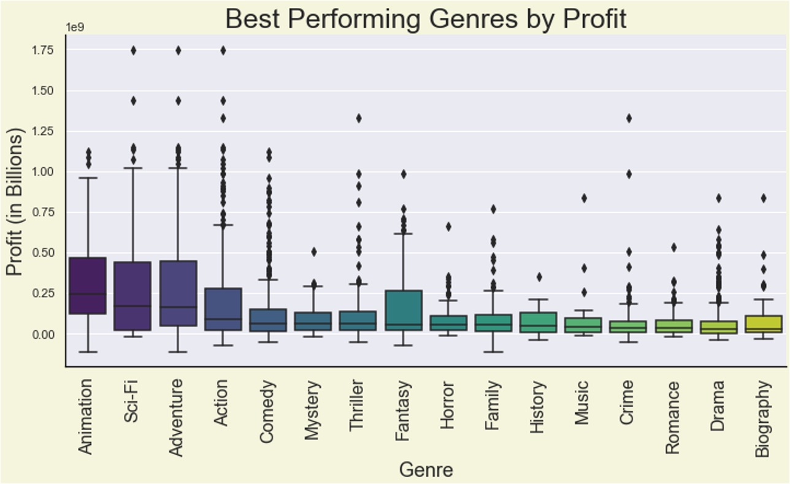
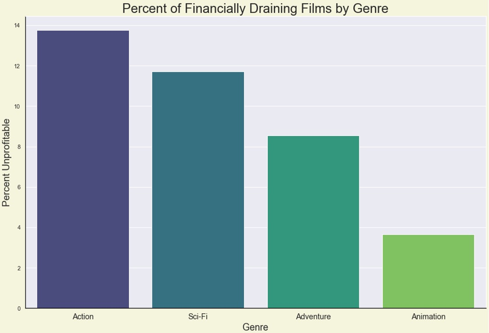
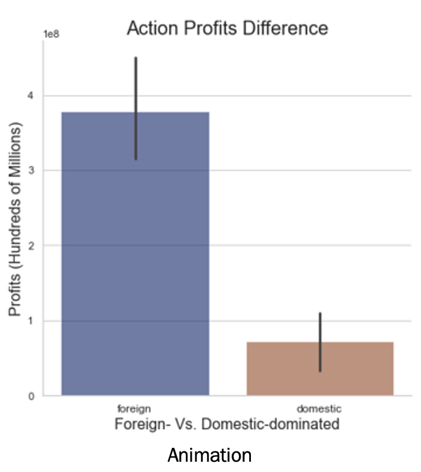
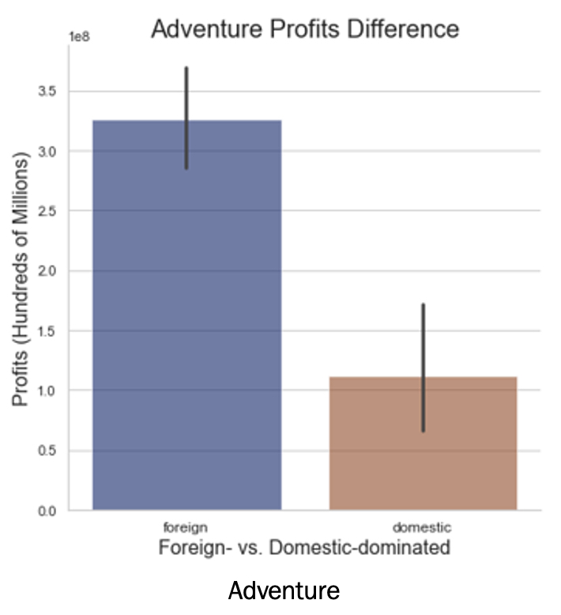

# Microsoft Enters the Film Industry
#### Authors: Lou Hines and Jamie Carnevale
## Overview
Microsoft is entering the film industry! By making data-oriented business decisions in this market, Microsoft can make a large amount of profit. 

## Business Understanding
The film industry is a gamble. It has its fair share of movies that are huge successes, but many end up financially draining the production companies funding them. By looking at cleaned historcal data, we have found important trends that Microsoft's new division can leverage so as to avoid these risks and maximize their profits. From our insights, we have created three business recommendations for Microsoft that will help them increase this likelihood, while utilizing the company's unique and mature global reputation and reach.

### We pulled data from leading industry repositories such as Box Office Mojo and IMDB. IMDB in particular has a very large dataset from which to glean, enhancing the meaning of our results.

## We Discovered and Analyzed the Most Profitable Genres:
-  Dwarfing the competition, we have: Animation, Science Fiction, Adventure, and Action
-  Our analysis shows wide spreads of profitability by many genres, including some of the top four.
-  Popuarity isn't everything: some less popular genres such as Animation are highly profitable, whereas some pervasive genres such as Drama 
   aren't nearly as profitable.
   

## Reduce Risk: Safest Genres
- Animation and Adventure have very low risks of being financially draining (negative profitablity), while Action and Sci-Fi have
  larger odds of being duds. Since Microsoft is not known to be a risk-prone company, we advise they continue in this vein. 

## Focus on Foreign Markets
- Movies that outperform (as a share of world gross) in foreign markets vs. domestic markets have a much higher overall profitability. By focusing on having a wide appeal to foreign audiences, Microsoft can further increase their chances to make highly profitable films. In these globally uncertain times, having a safe and broad appeal is more important than ever.

| Animation | Adventure |
|:---:|:---:| 
|  |  |

## Conclusion and Next Steps
### Conclusion
- Further analyze the most profitable and least risky genres, Animation and Adventure
- Catering towards foreign markets will increase profits 

### Next Steps
- Explore different combinations of high-profit, low-risk genres
- Explore successful films that were produced in foreign markets
- Take a long-view: look at long-term historical trends
- Explore directors and writers and their impact on profit

## Contact Information
| Name | Email | LinkedIn |
|:---:|:---:|:---:| 
| Jamie Carnevale | jamie.c.carnevale@gmail.com | https://www.linkedin.com/in/jamie-carnevale-abb0b5219/ |
| Lou Hines | hinesmeghan1@gmail.com | |

## Link to Presentation
[Microsoft Film Industry Recommendations.pdf](https://github.com/Lou-Hines/Movie_Production_Recommendations/files/11466555/Microsoft.Film.Industry.Recommendations.pdf)

