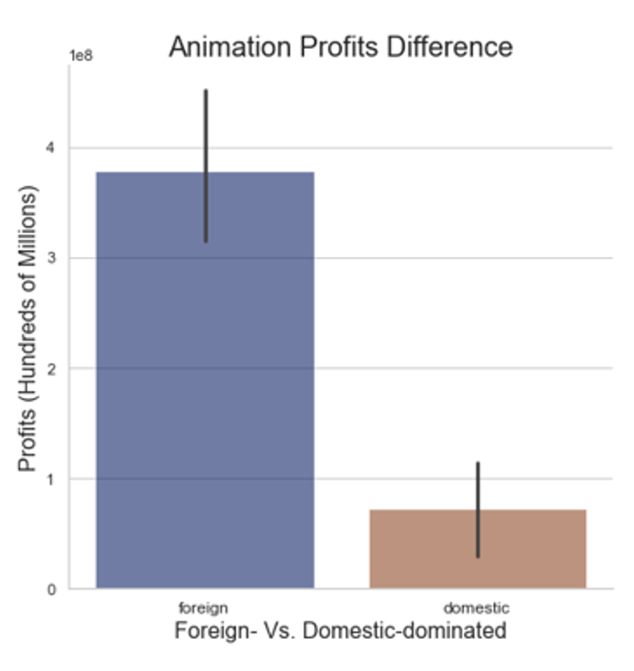
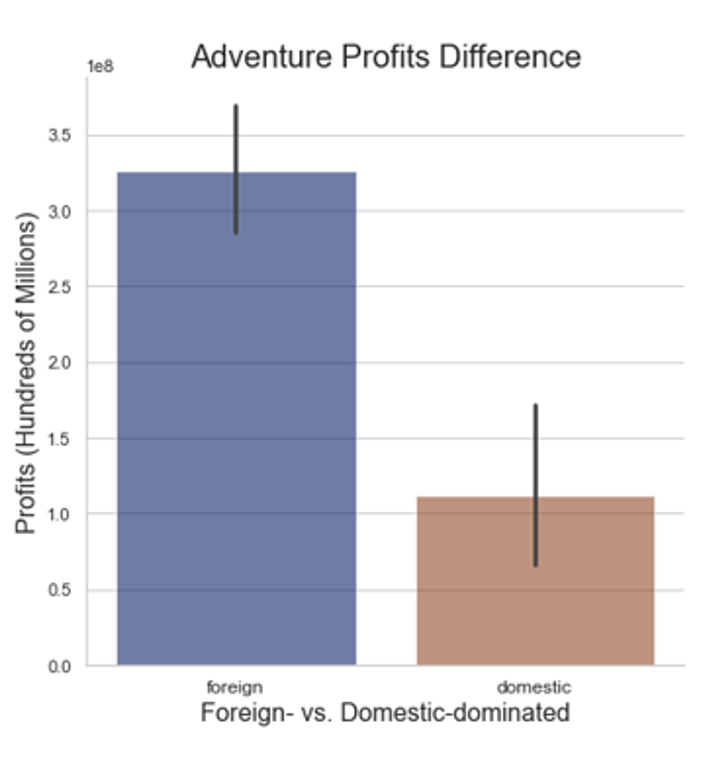

# Microsoft Enters the Film Industry
#### Authors: Lou Hines and Jamie Carnevale
## Overview
Microsoft is entering the film industry! By making data-oriented business decisions in this market, Microsoft can make a large amount of profit. 
## Business Understanding
The film industry has its fair share of business projects (movies) that either are huge successes and lead to enormous profits, or they end up financially draining the production companies that fund them. By looking at well-documented historical clean data, we have found important trends that Microsoft's new division can leverage. From these trends, we have created three business recommendations for Microsoft that will help them increase their liklihood of high profitablity and will ensure that they thoroughly avoid risk of financially draining projects.

### We pulled data from leading industry repositories such as Box Office Mojo and IMDB.

## Most Profitable Genres
- The four most profitable genres: Animation, Science Fiction, Adventure, and Action
-   While this data is sorted by median, these genres have a big upside potential as well
- Some less popular genres such as Animation are highly profitable, whereas some pervasive genres such as Drama are not nearly as profitable

## Safest Genres: Animation and Adventure
- Specifically, Animation and Adventure have very low risks of being financially draining (negative profitablity)

## Focus on Foreign Markets
- Movies that outperform in foreign markets vs domestic markets have a much higher overall profitability. By focusing on having a wide appeal to foreign audiences, Microsoft can further increase their chances to make highly profitable films

| Animation | Adventure |
|:---:|:---:| 
|  |  |

## Conclusion and Next Steps
### Conclusion
- Focus on the most profitable and riskless genres: Animation and Adventure
- Catering towards foreign markets will increase profits Next Steps
### Next Steps
- Explore directors and writers and their impact on profit
- Explore different combinations of high profit low risk genres
- Explore successful films that were produced in foreign markets

## Contact Information
| Name | Email | LinkedIn |
|:---:|:---:|:---:| 
| Jamie Carnevale | jamie.c.carnevale@gmail.com | https://www.linkedin.com/in/jamie-carnevale-abb0b5219/ |
| Lou Hines | hinesmeghan1@gmail.com | |

## Link to Presentation
[Microsoft Film Industry Recommendations.pdf](https://github.com/Lou-Hines/Movie_Production_Recommendations/files/11466555/Microsoft.Film.Industry.Recommendations.pdf)

